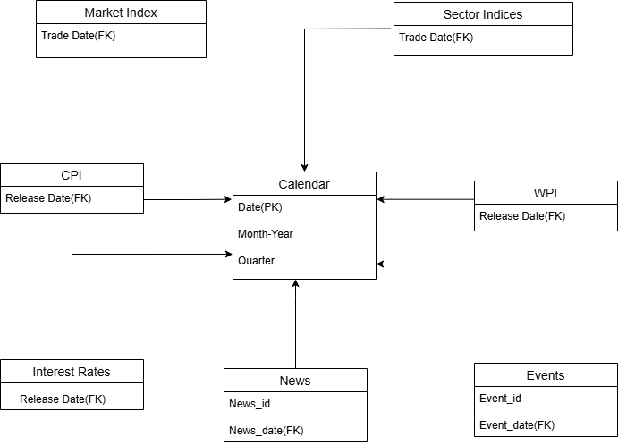
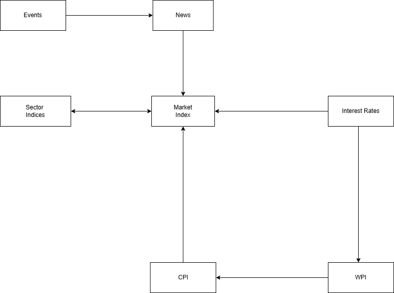
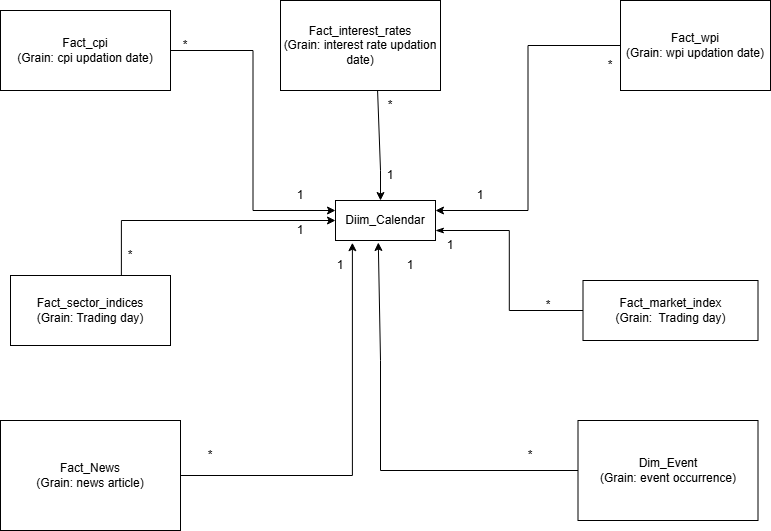
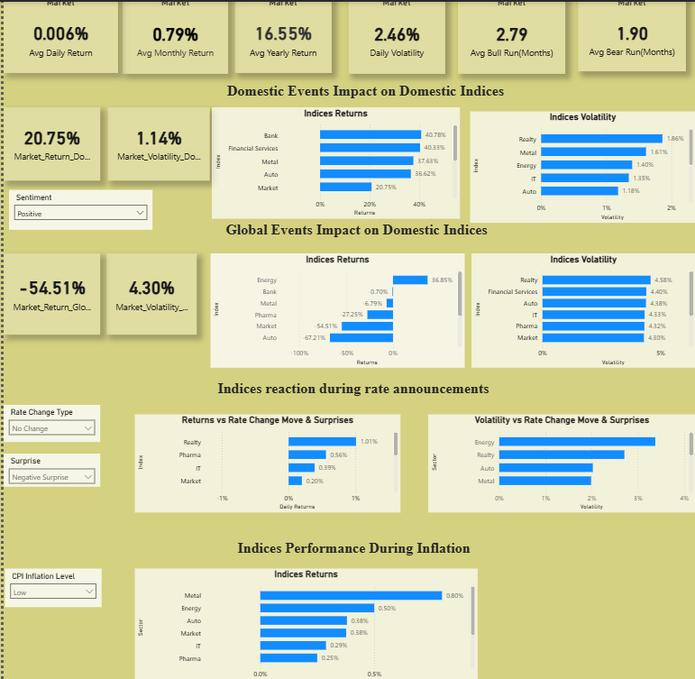
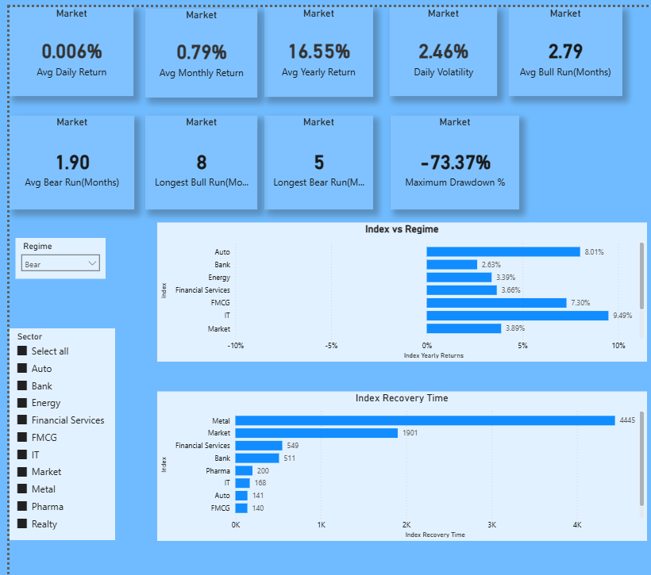
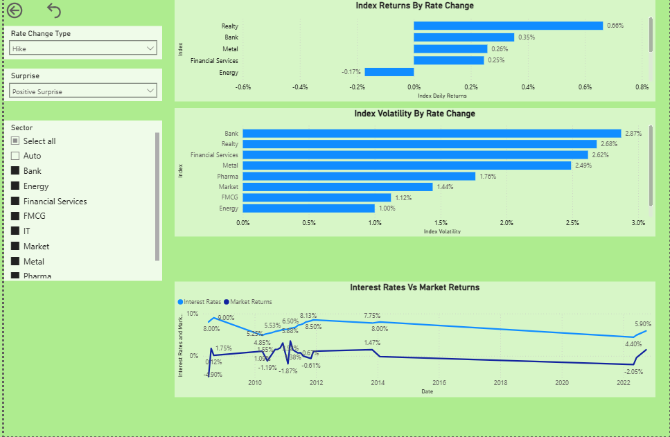
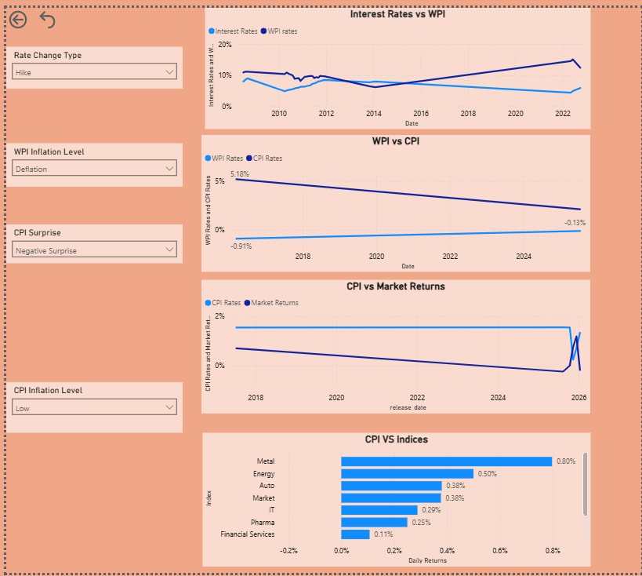
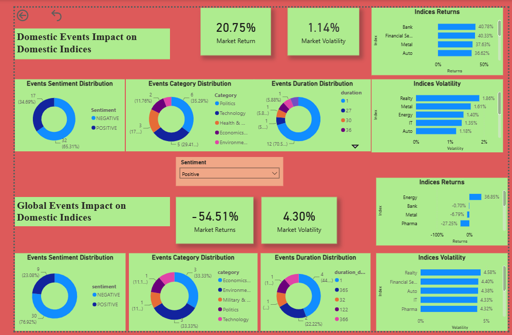

# Market Analytics

## Project Highlights
- Analyzed Nifty Midcap 150 index performance, sector behavior, and market regimes (~18 years of data).
- Evaluated interest rate sensitivity, inflation impact (CPI/WPI), and local_events-driven market reactions.
- Used **Distilled BERT** LLM model for sentiment, event type analysis for local_events &  global_events datasets.
- Built a star-schema data model with `dim_calendar` and multiple fact tables.
- Created a 5-page Power BI dashboard covering market regime, interest rates, inflation, local_events & global_events, and executive overview.


## Table of Contents
- [Market Analytics](#market-analytics)
  - [Project Highlights](#project-highlights)
  - [Table of Contents](#table-of-contents)
  - [Overview](#overview)
  - [Project Objectives](#project-objectives)
  - [Repository Structure](#repository-structure)
    - [Folder Overview](#folder-overview)
  - [Datasets Description](#datasets-description)
  - [Tools Used](#tools-used)
  - [Skills Demonstrated](#skills-demonstrated)
  - [Methodology](#methodology)
  - [Analytical Model](#analytical-model)
    - [ER Diagram](#er-diagram)
    - [Relationship Map](#relationship-map)
    - [Schema Diagram](#schema-diagram)
  - [Key Findings](#key-findings)
    - [Indices / Sector Performance](#indices--sector-performance)
    - [Interest Rate Impact](#interest-rate-impact)
    - [Inflation Analysis](#inflation-analysis)
    - [Events Analysis](#events-analysis)
  - [Recommendations](#recommendations)
  - [Power BI Dashboard](#power-bi-dashboard)
    - [1. Executive Summary](#1-executive-summary)
    - [2. Market Regime Analysis](#2-market-regime-analysis)
    - [3. Interest Rate Impact](#3-interest-rate-impact)
    - [4. Inflation Analysis](#4-inflation-analysis)
    - [5. Events Analysis](#5-events-analysis)
  - [How To Use](#how-to-use)

## Overview
An end to end analyis on  how macroeconomic factors—including interest rates, inflation, major local_events, and global global_events—affect the performance of the Nifty Midcap 150 and key sectoral indices. Using historical data from 2008–2026, the project identifies market regimes, evaluates sector sensitivity, and presents insights through an interactive Power BI dashboard.

## Project Objectives
- Analyze Nifty Midcap 150 index and sector-level performance across bull/bear regimes.
- Measure interest rate sensitivity of different sectors.
- Quantify inflation impact and correlations between CPI, WPI, and interest rates.
- Evaluate local_events sentiment impact on market returns and volatility.

## Repository Structure
```
├── data_raw/
├── data_cleaned/
├── data_model/
├── sql/
├── notebooks/
├── powerbi_reports/
├── reports
├── docs/
├── images/
│   └── dashboard_screenshots/
└── README.md
```

### Folder Overview

| Folder | Description |
|---------|-------------|
| **data_raw/** | Original datasets collected from various sources before cleaning. |
| **data_cleaned/** | Cleaned and transformed datasets used for analysis and dashboarding. |
| **data_model/** | Final analytical model, relationships, and prepared fact/dimension tables. |
| **sql/** | SQL scripts for KPI calculations, data validation, and analytical queries. |
| **notebooks/** | Python notebooks for data cleaning, EDA, feature engineering, and analysis. |
| **powerbi_reports/** | Power BI (.pbix) dashboard files. |
| **reports/** | Project documentation including dataset inventory, business questions, and KPI catalogue. |
| **docs/** | ER diagram, relationship map, schema diagram, and other technical documentation. |
| **images/** | Dashboard screenshots and images used in the README. |

## Datasets Description
**Market Analytics:**
- `facts_market_indices` — Daily Nifty Midcap 150 index values and sector indices (Auto, Bank, Energy, Financial Services, FMCG, IT, Metal, Pharma, Realty).
- `facts_cpi` — Consumer Price Index actual vs forecast releases.
- `facts_wpi` — Wholesale Price Index actual vs forecast releases.
- `facts_interest_rates` — Interest rate decisions (actual vs forecast vs previous).
- `dim_local_events` — local_events global_events with sentiment, category, severity, and duration.
- `dim_global_events` — Economic global_events calendar.

## Tools Used
- Python (data processing, EDA)
- SQL (KPI development)
- Power BI (dashboard development)
- MS Excel (For Cleaning used along with Python)

## Skills Demonstrated
- Data Cleaning
- Exploratory Data Analysis
- SQL Analytics
- Data Modeling
- Power BI
- DAX
- Time Series Analysis
- Financial Analytics
- Statistical Analysis
- Feature Engineering
- Business Intelligence
- LLM
- Sentiment Analysis
- Zero Shot Learning

## Methodology
```
Data Collection
↓
Data Cleaning
↓
Data Profiling
↓
EDA
↓
Feature Engineering
↓
Data Modeling
↓
SQL Analysis
↓
Dashboarding
↓
Insights
```
1. **Data Collection** -  Collected data from various sources.
2. **Data Cleaning**: Cleaned the extracted data to make it in usable format.
3. **Data Profiling** — Checked missing values, duplicates, and data types.
4. **Exploratory Data Analysis (EDA)** — Analyzed patterns across market indices and sectors.
5. **Feature Engineering** - Created custom features for doing deep dive analysis.
6. **Data Modeling** — Created star-schema relationships with `dim_calendar` connecting all fact tables.
7. **SQL Analysis** — Developed KPIs and business metrics.
8. **Insight Generation** — Identified trends, bottlenecks, and opportunities.
9. **Dashboard Development** — Built interactive Power BI dashboards (5 pages).

## Analytical Model
The data model follows a star-schema with `dim_calendar` as the central date dimension connected to all fact tables (`facts_market_indices`, `facts_cpi`, `facts_wpi`, `facts_interest_rates`, `dim_local_events`, `dim_global_events`).

### ER Diagram


### Relationship Map


### Schema Diagram


## Key Findings

### Indices / Sector Performance
- Average monthly Nifty Midcap 150 return: **1.28%**
- Market operates **~68% in bull regime**, **~32% in bear regime**
- Average bull run: **874.5 days** | Average bear run: **409 days**
- Biggest drawdown: Jan 2008 – Mar 2009 (1901 days to recover)
- Most resilient sectors: **FMCG, Auto, IT, Pharma**
- **Realty** most volatile; not recovered since 2008 peak
- Best performing sectors by year: 2009 – Nifty Metal; 2020 – Nifty Pharma

### Interest Rate Impact
- Rate hikes: ~23% | Cuts: ~21% | Unchanged: ~56%
- **Rate cuts more impactful for returns than hikes**
- Best during hikes: FMCG, Pharma, Realty, Metal
- Best during cuts: Realty, IT, Auto, Metal
- Least sensitive to shocks: Market index, FMCG, Energy, Pharma
- Consumer utilities perform better during high-rate periods
- Capex-driven sectors (Realty, Metal, Bank) perform best in low-rate periods

### Inflation Analysis
- CPI-WPI correlation strongest on CPI release dates immediately after WPI
- Interest rate impact on inflation indices takes months to reflect
- **Nifty Pharma**: least volatile during inflation changes
- **Nifty Realty**: most volatile during inflation changes
- Consumer utilities(FMCG, Pharma) perform better during high inflation
- Capex-driven sectors highly volatile during inflation changes

### Events Analysis
- Market reacts **1.2–1.65% more to negative local_events than positive**
- Negative local_events impact lasts **>3 months**; average recovery **6 months**
- Most stable sector: **Nifty Pharma**
- Most volatile sectors: Auto, Bank, IT, Metal
- Fastest recovery: **Energy, FMCG, Pharma**
- Slowest recovery: **Realty, Bank, Financial Services, IT**

## Recommendations
- Invest in **market index** when uncertain (outperforms most sectors)
- Stay longer in market to benefit from dominant bull regime
- **High rates/inflation**: invest in consumer utilities (FMCG, Pharma)
- **Low rates/inflation**: invest in capex-driven sectors (Realty, Metal, Bank)
- Consumer durables safest during uncertain market conditions
- Avoid capex-driven sectors during market shocks

## Power BI Dashboard
The Power BI report (`market_analytics.pbix`) contains 5 pages with year and month slicers. Below are the dashboard page references:

### 1. Executive Summary


### 2. Market Regime Analysis


### 3. Interest Rate Impact


### 4. Inflation Analysis


### 5. Events Analysis


## How To Use
1. Clone the repository.
2. Review the datasets in the `data_raw/` folder.
3. Review the notebooks for cleaning and EDA.
4. **Note** that it will require some manual cleaning as there could be issue with date format for which **MS-Excel** can be used or any other suitable tools. In my case I used MS-Excel for manual cleaning.
5. Open the SQL scripts for analysis.
6. Open `powerbi_reports/market_dashboard.pbix` in Power BI Desktop.
7. **Note** that `dim_calendar` doesn't exist before dashboarding its created for modelling.
